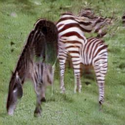

# Chainer-CycleGAN

This is an unofficial chainer re-implementation of a paper, [Unpaired Image-to-Image Translation using Cycle-Consistent Adversarial Networks](https://junyanz.github.io/CycleGAN/).
This implementation is based on [this](https://github.com/Aixile/chainer-cyclegan)

## Requirements
- Python 3.5+
- Chainer 2.0+
- ChainerCV 0.7+
- Numpy
- Matplotlib

## Usage
### Download and expand dataset
Downloadable datasets are listed in `./datasets/download_cyclegan_dataset.sh`
```
./datasets/download_cyclegan_dataset.sh <dataset>
```

### Training
```
python train.py --load_dataset <dataset> --gpu <gpu>
```

### Test for single image
```
python single_image_test.py <input_image> --gpu <gpu> --load_gen_model <trained_generator> --output <output_image>
```
left: input (horse), right: output (zebra)




## References
- [1]: JY. Zhu, et al. "Unpaired Image-to-Image Translation using Cycle-Consistent Adversarial Networks", in ICCV, 2017.
- [2]: [Original implementation in pytorch](https://github.com/junyanz/pytorch-CycleGAN-and-pix2pix)
- [3]: [Chainer-v1 implementation](https://github.com/Aixile/chainer-cyclegan)
